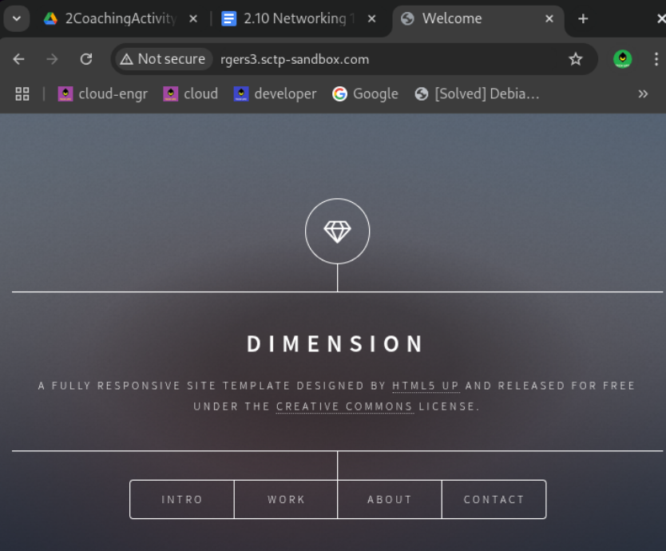
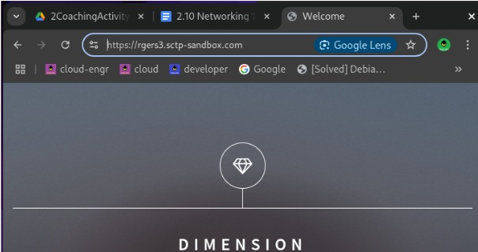
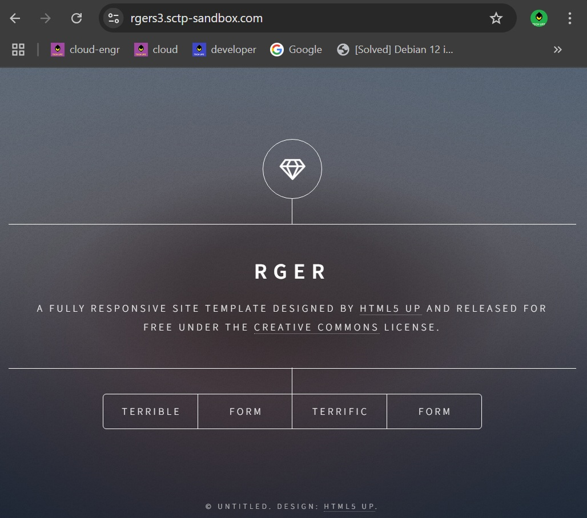

### Assignment: CloudFront w/S3 Static Site

Complete the activity to have the website accessible through CloudFront.
Take a screenshot of the web browser showing:
Accessible via friendly name (i.e. <alias>.sctp-sandbox.com)

Website is HTTPs secured

Website has been updated (e.g. change of text)
